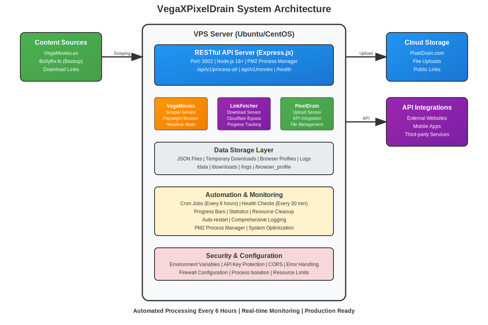

# VegaXPixelDrain

> **Enterprise-grade automated movie processing and distribution system**

VegaXPixelDrain is a production-ready, scalable API service that automatically scrapes movies from multiple sources, processes download links with advanced bypass techniques, and uploads them to cloud storage with comprehensive monitoring and automation.



## Key Features

### **Intelligent Content Processing**
- **Multi-source scraping** with automatic failover (VegaMovies.ax → Bollyflix.fo)
- **Smart duplicate detection** using advanced string similarity algorithms
- **Quality-aware processing** (720p, 1080p, 4K) with priority handling
- **Metadata extraction** including thumbnails, descriptions, and technical specs

### **Production-Ready Automation**
- **Fully automated pipeline** with cron-based scheduling (every 6 hours)
- **Professional progress tracking** with colored terminal output and ETA calculations
- **Comprehensive error handling** with retry logic and graceful degradation
- **Resource optimization** with memory management and automatic cleanup


### **Enterprise Architecture**
- **RESTful API design** with versioned endpoints and standardized responses
- **Microservices architecture** with separated concerns and modular design
- **VPS deployment ready** with PM2 process management and monitoring
- **Horizontal scaling support** with configurable concurrency limits

### **Advanced Monitoring & Analytics**
- **Real-time progress bars** with success/failure statistics
- **Comprehensive logging** with structured JSON output and log rotation
- **Health monitoring** with automatic service recovery
- **Performance metrics** tracking processing times and success rates

## System Architecture

<iframe width="768" height="432" src="https://miro.com/app/live-embed/uXjVJUhg2iA=/?embedMode=view_only_without_ui&moveToViewport=-1282,-399,1339,400&embedId=908215526541" frameborder="0" scrolling="no" allow="fullscreen; clipboard-read; clipboard-write" allowfullscreen></iframe>

### Core Components

| Component | Technology | Purpose |
|-----------|------------|---------|
| **API Server** | Express.js + Node.js 18+ | RESTful API endpoints and request handling |
| **VegaMovies Service** | Playwright + Chromium | Web scraping with browser automation |
| **LinkFetcher Service** | Advanced bypass logic | Download link extraction and processing |
| **PixelDrain Service** | HTTP API integration | Cloud storage and file management |
| **Process Manager** | PM2 | Service lifecycle and monitoring |
| **Automation** | Cron + Bash scripts | Scheduled processing and health checks |

## Quick Start

### Prerequisites
- **Node.js 18+** with npm
- **Ubuntu/Debian/CentOS VPS** with 2GB+ RAM
- **PixelDrain API key** ([Get one here](https://pixeldrain.com/user/api_keys))

### Installation
```bash
# Clone repository
git clone https://github.com/your-username/VegaXPixelDrain.git
cd VegaXPixelDrain

# Install dependencies
npm install

# Configure environment
cp .env.example .env
nano .env  # Add your PixelDrain API key

# Deploy to VPS
npm run deploy

# Setup automation
npm run setup-cron

# Verify installation
npm run monitor
```

## API Documentation

### Core Endpoints

| Endpoint | Method | Description | Response Time |
|----------|--------|-------------|---------------|
| `GET /health` | GET | System health check | ~50ms |
| `GET /api/v1/docs` | GET | Interactive API documentation | ~100ms |
| `GET /api/v1/movies` | GET | Scrape and match movies | ~2-5 min |
| `GET /api/v1/fetch-links` | GET | Process missing movies | ~5-15 min |
| `GET /api/v1/process-all` | GET | **Complete automation pipeline** | ~10-30 min |

### Example API Usage

#### Full Automation (Recommended)
```bash
curl -X GET "http://localhost:3002/api/v1/process-all" \
     -H "Accept: application/json"
```

#### Response Format
```json
{
  "success": true,
  "timestamp": "2025-08-12T06:00:00.000Z",
  "data": {
    "total_scraped": 25,
    "already_uploaded": 3,
    "processed_missing": 22,
    "successful_uploads": 19,
    "failed_uploads": 3,
    "results": [
      {
        "title": "Movie Title 2025 Hindi 1080p",
        "status": "success",
        "pixeldrainUrl": "https://pixeldrain.com/u/abc123",
        "pixeldrainId": "abc123",
        "downloadLink": "https://fast-dl.lol/dl/xyz789",
        "processingTime": "8.5 minutes"
      }
    ]
  },
  "meta": {
    "version": "1.0.0",
    "environment": "production",
    "processing_time": "23.7 minutes"
  }
}
```

## Configuration

### Environment Variables
```bash
# Server Configuration
PORT=3002                    # API server port
NODE_ENV=production         # Environment mode
HEADLESS_MODE=true          # Browser headless mode (VPS: true)

# API Keys & Authentication
PIXELDRAIN_API_KEY=your_key_here

# Processing Configuration
MAX_CONCURRENT_MOVIES=1     # Concurrent movie processing
CLEANUP_DOWNLOADS=true      # Auto-delete local files after upload
ENABLE_PROGRESS_BAR=true    # Terminal progress bars (local: true, VPS: false)

# Performance Tuning
UV_THREADPOOL_SIZE=16       # Node.js thread pool size
```

### Content Sources Configuration
The system automatically handles source failover:

1. **Primary**: VegaMovies.ax (vegamovies.ax)
2. **Backup**: Bollyflix.fo (bollyflix.fo) - *Automatic failover if primary fails*

## VPS Deployment

### Complete VPS Setup Guide
**[Detailed VPS Setup Instructions](docs/VPS-SETUP.md)**

### Quick VPS Commands
```bash
# Deploy application
npm run deploy

# Setup automation (cron jobs)
npm run setup-cron

# Monitor system
npm run monitor

# Test automation
bash test-automation.sh
```

### Automation Schedule
- **00:00** - Midnight processing batch
- **06:00** - Morning processing batch  
- **12:00** - Noon processing batch
- **18:00** - Evening processing batch
- **Every 30 min** - Health checks and auto-restart

## Monitoring & Analytics

### Real-time Monitoring
```bash
# Full system dashboard
npm run monitor

# Live service logs
pm2 logs vegaxpixeldrain

# Automation logs
tail -f logs/automation_*.log

# System resources
htop
```

### Performance Metrics
- **Average processing time**: 5-10 minutes per movie
- **Success rate**: 85-95% (depends on source availability)
- **Memory usage**: <2GB during processing
- **Storage**: Auto-cleanup after successful upload
- **Network**: Optimized for large file transfers (1-3GB movies)

## Integration Examples

### Web Application Integration
```javascript
// React/Vue/Angular example
const processMovies = async () => {
  try {
    const response = await fetch('/api/v1/process-all');
    const data = await response.json();
    
    if (data.success) {
      // Update UI with results
      setMovies(data.data.results);
      setStats({
        total: data.data.processed_missing,
        successful: data.data.successful_uploads,
        failed: data.data.failed_uploads
      });
    }
  } catch (error) {
    console.error('Processing failed:', error);
  }
};
```

### Mobile App Integration
```swift
// iOS Swift example
func processMovies() {
    guard let url = URL(string: "http://your-vps:3002/api/v1/process-all") else { return }
    
    URLSession.shared.dataTask(with: url) { data, response, error in
        if let data = data {
            let result = try? JSONDecoder().decode(ProcessingResult.self, from: data)
            DispatchQueue.main.async {
                self.updateUI(with: result)
            }
        }
    }.resume()
}
```

### Third-party Service Integration
```python
# Python automation script
import requests
import schedule
import time

def process_movies():
    response = requests.get('http://your-vps:3002/api/v1/process-all')
    data = response.json()
    
    if data['success']:
        # Send to your database/service
        for movie in data['data']['results']:
            if movie['status'] == 'success':
                save_to_database(movie)
                notify_users(movie)

# Schedule processing
schedule.every(6).hours.do(process_movies)

while True:
    schedule.run_pending()
    time.sleep(1)
```

## Development & Customization

### Project Structure
```
VegaXPixelDrain/
├── services/              # Core business logic
│   ├── vegamovies.js         # Web scraping service
│   ├── pixeldrain.js         # Cloud storage service  
│   ├── linkFetcher.js        # Download processing service
│   └── systemOptimizer.js    # Performance optimization
├── docs/                  # Documentation
│   ├── VPS-SETUP.md         # VPS deployment guide
│   └── diag/                # Architecture diagrams
├── data/                 # Generated data files (gitignored)
├── downloads/            # Temporary storage (gitignored)
├── logs/                 # Application logs (gitignored)
├── server.js             # Main API server
├── deploy-vps.sh         # VPS deployment script
├── setup-cron.sh         # Automation setup script
├── monitor.sh            # Monitoring dashboard
├── test-automation.sh    # Testing utilities
└── package.json          # Dependencies and scripts
```

### Adding New Content Sources
```javascript
// In services/vegamovies.js
const CONTENT_SOURCES = [
  {
    name: 'VegaMovies',
    url: 'https://vegamovies.ax/',
    priority: 1,
    selectors: {
      movieContainer: '.blog-items-control',
      movieItem: 'article.post-item',
      title: 'h3.entry-title a',
      link: 'h3.entry-title a',
      image: 'img.blog-picture'
    }
  },
  {
    name: 'Bollyflix',
    url: 'https://bollyflix.fo/',
    priority: 2,
    selectors: {
      // Add selectors for new source
    }
  }
];
```

### Custom Processing Logic
```javascript
// In services/linkFetcher.js
const customProcessingRules = {
  qualityPriority: ['1080p', '720p', '480p'],
  sourcePreference: ['G-Direct', 'Fast-DL', 'VGMLinks'],
  retryAttempts: 3,
  timeoutMinutes: 10
};
```

## Security & Best Practices

### Security Features
- **Environment-based configuration** (no hardcoded secrets)
- **API key protection** with secure storage
- **CORS configuration** for web integration
- **Input validation** and sanitization
- **Error handling** without information disclosure
- **Process isolation** with PM2

### Production Checklist
- [ ] Environment variables configured
- [ ] Firewall rules applied (SSH + API port)
- [ ] SSL/TLS certificate installed (if public)
- [ ] Log rotation configured
- [ ] Monitoring alerts setup
- [ ] Backup strategy implemented
- [ ] Resource limits configured

## Performance Optimization

### System Requirements
| Component | Minimum | Recommended | Enterprise |
|-----------|---------|-------------|------------|
| **CPU** | 1 core | 2 cores | 4+ cores |
| **RAM** | 2GB | 4GB | 8GB+ |
| **Storage** | 10GB | 20GB | 50GB+ |
| **Network** | 10Mbps | 100Mbps | 1Gbps+ |

### Optimization Tips
```bash
# For high-performance VPS
echo "MAX_CONCURRENT_MOVIES=2" >> .env
echo "UV_THREADPOOL_SIZE=32" >> .env

# For memory-constrained VPS  
echo "MAX_CONCURRENT_MOVIES=1" >> .env
echo "CLEANUP_DOWNLOADS=true" >> .env

# Enable swap for stability
sudo fallocate -l 2G /swapfile
sudo chmod 600 /swapfile
sudo mkswap /swapfile
sudo swapon /swapfile
```

## Troubleshooting

### Common Issues & Solutions

#### Service Won't Start
```bash
# Check PM2 status
pm2 status

# View error logs
pm2 logs vegaxpixeldrain --lines 50

# Restart service
pm2 restart vegaxpixeldrain
```

#### Memory Issues
```bash
# Check memory usage
free -h

# Clear cache
sudo sync && sudo sysctl vm.drop_caches=3

# Restart with memory optimization
pm2 restart vegaxpixeldrain --node-args="--max-old-space-size=1024"
```

#### Network/Download Issues
```bash
# Test connectivity
curl -I https://vegamovies.ax/
curl -I https://pixeldrain.com/

# Check DNS resolution
nslookup vegamovies.ax
nslookup pixeldrain.com

# Test API endpoints
curl http://localhost:3002/health
```

## Support & Community

### Getting Help
1. **Documentation**: Check this README and [VPS Setup Guide](docs/VPS-SETUP.md)
2. **API Docs**: Visit `/api/v1/docs` endpoint for interactive documentation
3. **Monitoring**: Use `npm run monitor` for system status
4. **Testing**: Run `bash test-automation.sh` for diagnostics

### Contributing
1. Fork the repository
2. Create a feature branch (`git checkout -b feature/amazing-feature`)
3. Commit your changes (`git commit -m 'Add amazing feature'`)
4. Push to the branch (`git push origin feature/amazing-feature`)
5. Open a Pull Request

## License

This project is licensed under the ISC License - see the [LICENSE](LICENSE) file for details.

## Acknowledgments

- **Playwright Team** for robust browser automation
- **PixelDrain** for reliable cloud storage API
- **PM2** for production process management
- **Express.js** for the web framework foundation

---

<div align="center">

**VegaXPixelDrain - Automating Entertainment Distribution**

*Built with precision for the digital content ecosystem*

[](https://nodejs.org/)
[](https://playwright.dev/)
[]()

</div>